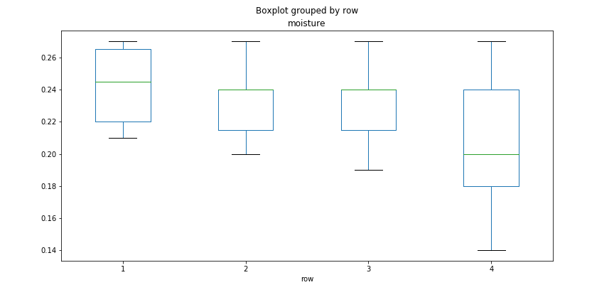
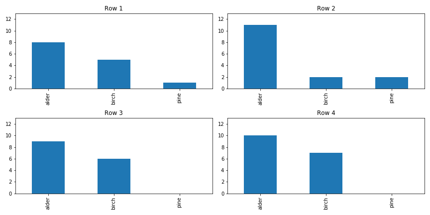

# Bayesian Firewood Stacking
Final project for Fall 2020 ISYE 6420 Georgia Tech Class

## Introduction
My new woodstove advertises an overall efficiency of 77% with a 10 hour burn time. Being a poor planner, I had this woodstove installed late this fall and I only have four rows of firewood stacked currently. (The purchase was a little bit of an impulse buy after a power outage disabled my home's heating for a day).

My four rows of firewood each measure about 6 ft depth, 4 ft height, and 1.5 ft width. This makes each row of firewood equal to about 0.281 cords. (In the US, a cord of firewood is typically 4x8x4 ft.)

My firewood is comprised of a mixture of alder, birch, and pine all gathered from trees knocked down by windstorms or standing dead trees that needed to be thinned. I stacked each row sequentally, and during the earlier portion of my firewood collection I specifically targeted trees that had been knocked over by wind and were blocking pathways, then for later rows I targeted standing dead trees.

Based on information from [this website](http://pages.sssnet.com/go2erie/FirewoodChart.htm), each species of firewood contains varying amounts of million BTUs (British Thermal Units) per cord of properly seasoned firewood.

| Species | Million BTUs per Cord |
|---------|-----------------------|
| Alder   | 19.0                  |
| Birch   | 23.6                  |
| Pine    | 20.5                  |

My home is quite well insulated and not that big, and our winters aren't that intense, so with the help of [this website](https://www.calculator.net/btu-calculator.html) I estimate that I'll need about 250k BTUs per day when using my woodstove (again, about 10 hours per day of actual burning time).

A rule of thumb is that properly seasoned firewood has a moisture content between 15 and 20 percent. From experience, though, alder wood burns nicely up to about 23 percent since it's an especially soft wood. Given that I was late to collect firewood, I'm expecting that most of my woodpile won't be ready to burn this season, except for the standing dead trees that had already dried before I harvested them.

I've gone ahead and recorded observations for species and moisture content of all the firewood peices I can access in my wood pile (using a moisture meter). However, my woodshed is partially walled, and I can only access one side of each row at this point. I'd like to use this data to estimate how many days worth of seasoned firewood I have.

## Exploratory Data Analysis

I have 61 total measurements across four rows of firewood.

| Row | Samples |
|-----|---------|
| 1   | 14      |
| 2   | 15      |
| 3   | 15      |
| 4   | 17      |

While cutting firewood, I focused more on standing dead trees later in the process, so it makes sense that later rows of firewood have lower moisture content.

There was only one pine tree in the mix, and I think I had worked through it before finishing stacking the second row.

Finally, each species has somewhat different distributions of moisture content.

