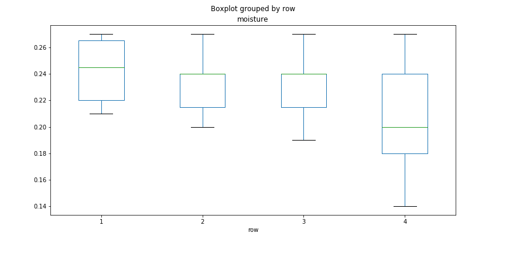
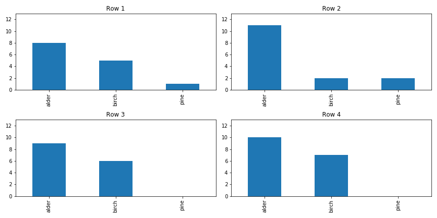
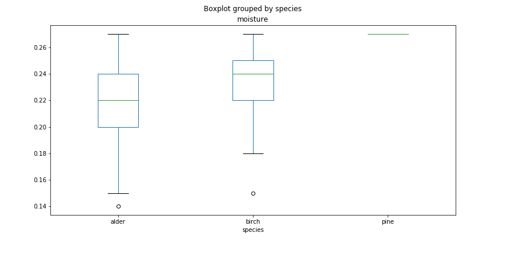
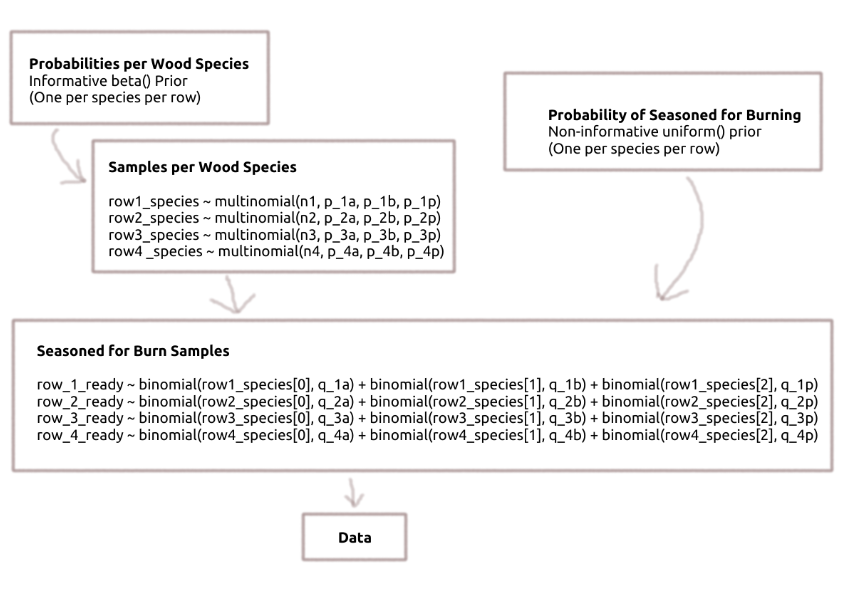

# Bayesian Firewood Stacking
Final project for Fall 2020 ISYE 6420 Georgia Tech Class

## Introduction
My new woodstove advertises an overall efficiency of 77% with a 10 hour burn time. Being a poor planner, I had this woodstove installed late this fall and I only have four rows of firewood stacked currently. (The purchase was a little bit of an impulse buy after a power outage disabled my home's heating for a day).

My four rows of firewood each measure about 6 ft depth, 4 ft height, and 1.5 ft width. This makes each row of firewood equal to about 0.281 cords. (In the US, a cord of firewood is typically 4x8x4 ft.)

My firewood is comprised of a mixture of alder, birch, and pine all gathered from trees knocked down by windstorms or standing dead trees that needed to be thinned. I stacked each row sequentally, and during the earlier portion of my firewood collection I specifically targeted trees that had been knocked over by wind and were blocking pathways, then for later rows I targeted standing dead trees.

Based on information from [this website](http://pages.sssnet.com/go2erie/FirewoodChart.htm), each species of firewood contains varying amounts of million BTUs (British Thermal Units) per cord of properly seasoned firewood.

| Species | Million BTUs per Cord |
|---------|-----------------------|
| Alder   | 19.0                  |
| Birch   | 23.6                  |
| Pine    | 20.5                  |

My home is quite well insulated and not that big, and our winters aren't that intense, so with the help of [this website](https://www.calculator.net/btu-calculator.html) I estimate that I'll need about 250k BTUs per day when using my woodstove (again, about 10 hours per day of actual burning time).

A rule of thumb is that properly seasoned firewood has a moisture content between 15 and 20 percent. From experience, though, alder wood burns nicely up to about 23 percent since it's an especially soft wood. Given that I was late to collect firewood, I'm expecting that much of my woodpile won't be ready to burn this season, except for the standing dead trees that had already dried before I harvested them.

I've gone ahead and recorded observations for species and moisture content of all the firewood peices I can access in my wood pile (using a moisture meter). However, my woodshed is partially walled, and I can only easily access one side of each row at this point. I'd like to use this data to estimate how many days worth of seasoned firewood I have.

## Exploratory Data Analysis

EDA code is available here: [https://github.com/kevinpalm/bayesian-firewood-stacking/blob/main/EDA.ipynb](https://github.com/kevinpalm/bayesian-firewood-stacking/blob/main/EDA.ipynb)

I have 61 total measurements across four rows of firewood.

| Row | Samples |
|-----|---------|
| 1   | 14      |
| 2   | 15      |
| 3   | 15      |
| 4   | 17      |

While cutting firewood, I focused more on standing dead trees later in the process, so it makes sense that later rows of firewood have lower moisture content.

There was only one pine tree in the mix, and I think I had worked through it before finishing stacking the second row.

Finally, each species has somewhat different distributions of moisture content.

## Modeling

### Framework and Priors

My data is very much a convenience sample - I just measured the logs I could reach without disturbing the stack. Logs from the same tree probably ended up stacked near each other, so I'm not sure I trust my dataset to represent the whole woodpile as much as I would if I knew each sample was drawn randomly. Because of the convenience sampling, and because of the small sample sizes, and because I stacked these rows of firewood myself, I'm interested in incorporating informative priors about the proportions of each tree species. I'll model the species of wood in each row sample as separate multinomial distributions, with beta priors.

| Row | Percent Alder Prior | Percent Birch Prior | Percent Pine Prior |
|-----|---------------------|---------------------|--------------------|
| 1   | beta(5, 5)          | beta(2, 8)          | beta(3, 7)         |
| 2   | beta(7, 3)          | beta(2, 8)          | beta(1, 9)         |
| 3   | beta(15, 5)         | beta(4, 16)         | beta(1, 19)        |
| 4   | beta(15, 5)         | beta(4, 16)         | beta(1, 19)        |

I don't really have prior beliefs about the percent moisture content of my firewood, so I'll use noninformative priors. I'll also transform my data just a little so that I can more directly model what percent of each species per row is already seasoned enough to burn. I'll be modeling each row per each species as separate binomial distributions. Each binomial distribution will measure what percent of wood is less than or equal to 20% moisture for birch and pine, and less than or equal to 23% moisture for alder - at which point the firewood is considered seasoned and ready enough to burn.

The model framework will end up looking something like this:

After fitting the model to the data, my original question for how many days of fuel are contained in the firewood can be calculated based on the probability of each tree species and the probabilities that the wood is seasoned enough to burn.

### Implementation

Model implementation was completed using pystan and is available here: 